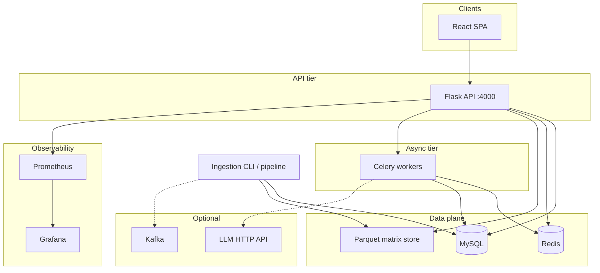
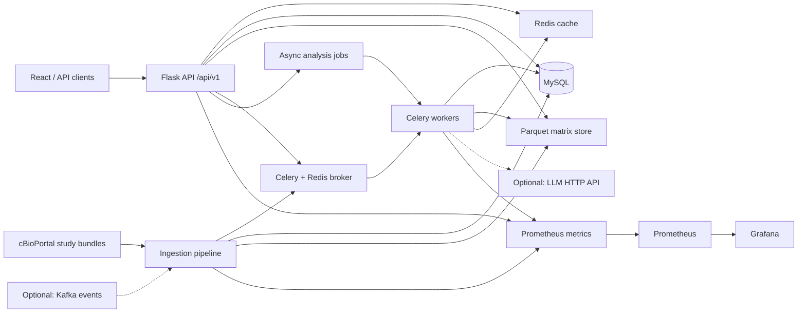
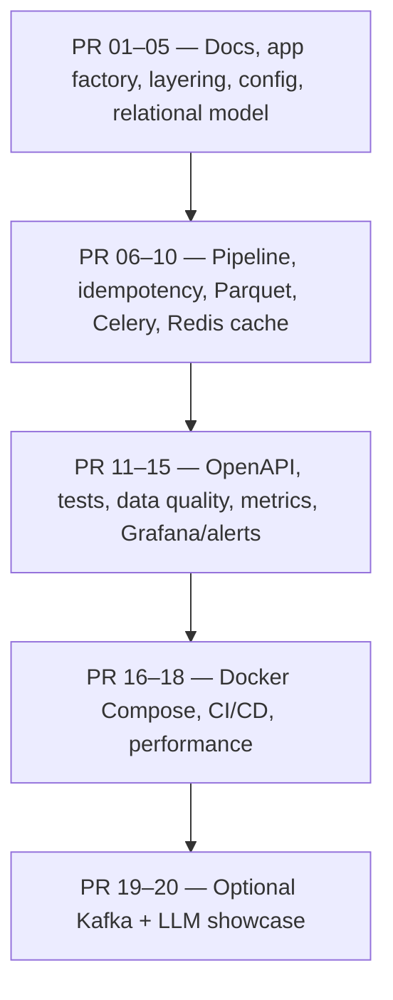

# BCancerPortal

**bcancerportal** is a **cBioPortal-inspired** genomics exploration stack: a **Flask REST API** and **React** SPA for breast-cancer-focused studies, with a **pipeline-oriented backend** (SQL + Parquet matrices), **async jobs** (Celery), **caching** (Redis), and **platform-style** ops (metrics, runbooks, CI, optional Kafka / LLM).

---

## Overview

| Layer | Role |
|--------|------|
| **Client** | React app (`frontend/`) calls versioned APIs under `/api/v1` (legacy `/api` kept for the existing UI). |
| **API** | Gunicorn/Flask: datasets, clinical, summary, analysis, heatmap, OpenAPI, health/readiness, Prometheus scrape. |
| **Compute** | Celery workers for long-running analysis and optional LLM calls (OpenAI-compatible endpoint). |
| **Data** | **MySQL**: study metadata, clinical/mutation tables, job and ingestion tracking. **Parquet**: wide matrix-style files via the ingestion pipeline (`MATRIX_STORAGE_DIR`). |
| **Platform** | Redis (broker + cache), optional Kafka (ingestion events), Compose stacks under `infra/docker/`. |

Authoritative deep-dive: [`doc/core-platform-architecture.md`](doc/core-platform-architecture.md). API draft: [`doc/api-contract.md`](doc/api-contract.md). Operations: [`doc/runbook.md`](doc/runbook.md). ADRs: [`doc/adr/`](doc/adr/).

---

## Architecture

### Logical system



- **Synchronous path:** browser → Flask → MySQL / Redis cache / Parquet reads for heavy slices.
- **Asynchronous path:** Flask enqueues Celery → workers update job rows and touch DB/LLM as needed.
- **Ingestion:** staged pipeline (`backend/pipeline/`) loads relational tables and materializes matrices; optional **Kafka** events for lifecycle fan-out.

### Platform blueprint (control, data, and observability)

This **left-to-right** schema matches the **core platform roadmap** narrative (docs + phased PRs): API and cache, split storage (SQL + Parquet), staged ingestion, Celery analytics, metrics, and optional Kafka / LLM. Full step-by-step list: [`doc/pr-roadmap.md`](doc/pr-roadmap.md).



**Planes (same idea as the plan doc):** **Control/API** (Flask), **Data** (MySQL + Parquet), **Queue** (Redis + Celery), **Pipeline** (discover → validate → transform → load → verify), **Observability** (Prometheus/Grafana, request IDs), **Optional** (Kafka ingestion fan-out, OpenAI-compatible LLM for `llm_infer` jobs).

### Delivery phases (condensed PR roadmap)



### Backend layering

```
HTTP (routes/)  →  services/  →  repositories/ + pipeline/
                              ↘  workers/ (Celery tasks)
core/          →  config, app factory, pagination, time helpers
api/           →  OpenAPI, error envelope, v1 route registration
observability/ →  metrics, request IDs
extensions.py  →  SQLAlchemy, Migrate
```

Design intent: **thin resources**, **testable services**, **explicit pipeline stages**, **versioned public API** with a **compat layer** for legacy paths.

---

## Features

- Browse studies/datasets by cancer type
- Summary dashboards (Plotly) and clinical tables (paginated API)
- Mutation and omics-oriented views; matrix data via pipeline/Parquet where applicable
- Async **analysis jobs** (e.g. survival, optional **`llm_infer`**)
- **Health** (`/healthz`), **readiness** (`/readyz`), **metrics** (`/metrics`)

---

## Repository layout

```
bcancerportalbd/
├── backend/                 # Python platform (see backend/README.md)
│   ├── app.py               # Entrypoint
│   ├── core/                # Config, factory helpers, datetime, pagination
│   ├── api/                 # OpenAPI, errors, v1 registration
│   ├── routes/              # Flask-RESTful resources
│   ├── services/            # Domain logic
│   ├── repositories/        # DB access patterns
│   ├── pipeline/            # Ingestion stages + run tracking
│   ├── workers/             # Celery app + tasks
│   ├── events/              # Optional Kafka producer
│   ├── observability/       # Metrics, request context
│   ├── migrations/          # Alembic
│   ├── tests/
│   └── requirements.txt
├── frontend/                # React SPA
├── doc/                     # Architecture, ADRs, runbook, API contract
├── infra/docker/            # Compose: app, monitoring, Kafka, LLM
└── .github/workflows/       # CI
```

---

## CI

GitHub Actions ([`.github/workflows/ci.yml`](.github/workflows/ci.yml)) on `main` / `master` and PRs: **Ruff** (`backend/`), **pytest** + coverage gate ([`pytest.ini`](pytest.ini)), **pip-audit** on [`backend/requirements.txt`](backend/requirements.txt), **Docker** build of [`backend/Dockerfile`](backend/Dockerfile). Use branch protection to require these checks before merge.

---

## Docker

Run **API** (Gunicorn), **Celery worker**, **MySQL**, and **Redis** with Compose. Commands below assume the **repository root**.

### Prerequisites

- [Docker](https://docs.docker.com/get-docker/) and Docker Compose v2

### Start the stack

```bash
docker compose -f infra/docker/docker-compose.yml up -d --build
```

Apply database migrations (first run and after migration changes):

```bash
docker compose -f infra/docker/docker-compose.yml exec api flask db upgrade
```

### URLs and defaults

- API: [http://localhost:4000](http://localhost:4000)
- Health: [http://localhost:4000/healthz](http://localhost:4000/healthz)
- Readiness (includes DB check): [http://localhost:4000/readyz](http://localhost:4000/readyz)
- Prometheus metrics: [http://localhost:4000/metrics](http://localhost:4000/metrics)

Compose uses dev-oriented MySQL credentials (`root` / `rootpass`, database `cancer_db`). Override via env or edit [`infra/docker/docker-compose.yml`](infra/docker/docker-compose.yml). Set `SECRET_KEY` before production use ([`.env.example`](.env.example)).

### Monitoring (Prometheus + Grafana)

The monitoring compose file joins the app network so Prometheus can scrape `api:4000`.

1. Start the app stack first (creates network `bcancerportal_net`).
2. Then:

```bash
docker compose -f infra/docker/docker-compose.monitoring.yml up -d
```

- Prometheus: [http://localhost:9090](http://localhost:9090)
- Grafana: [http://localhost:3001](http://localhost:3001) (default admin/admin in compose)

More detail: [`doc/runbook.md`](doc/runbook.md).

### Stop

```bash
docker compose -f infra/docker/docker-compose.yml down
docker compose -f infra/docker/docker-compose.monitoring.yml down
```

### Optional Kafka (ingestion events)

`docker compose -f infra/docker/docker-compose.kafka.yml up -d`, then `KAFKA_ENABLED=true` and `KAFKA_BOOTSTRAP_SERVERS` ([`.env.example`](.env.example)). Topics: `ingestion.events`, `ingestion.dlq`. See [`doc/runbook.md`](doc/runbook.md), [`doc/adr/ADR-0008-kafka-ingestion-events.md`](doc/adr/ADR-0008-kafka-ingestion-events.md).

### Optional LLM inference (async jobs)

`POST /api/v1/analysis/jobs` with `"job_type": "llm_infer"`. Stub response if LLM is not configured. Local stack: [`infra/docker/docker-compose.llm.yml`](infra/docker/docker-compose.llm.yml) (Ollama). See [`doc/adr/ADR-0007-llm-service-boundary.md`](doc/adr/ADR-0007-llm-service-boundary.md).

---

## Local development

### Prerequisites

- Python **3.12+** (see [`backend/Dockerfile`](backend/Dockerfile))
- Node.js **18+** (frontend)
- **MySQL 8+** (or use app Compose stack)

### Backend

1. **Create the MySQL database** (must exist before `flask db upgrade`). Names should match `MYSQL_DB` / `MYSQL_DB_TEST` in `.env` (defaults `cancer_db`, `cancer_db_test`):

   ```bash
   mysql -u root -p -e "CREATE DATABASE IF NOT EXISTS cancer_db CHARACTER SET utf8mb4 COLLATE utf8mb4_unicode_ci;"
   mysql -u root -p -e "CREATE DATABASE IF NOT EXISTS cancer_db_test CHARACTER SET utf8mb4 COLLATE utf8mb4_unicode_ci;"
   ```

2. Virtualenv and install:

```bash
python -m venv venv
source venv/bin/activate  # Windows: venv\Scripts\activate
pip install -r backend/requirements.txt
```

3. Environment: copy [`.env.example`](.env.example) to `.env` at **repo root** (or `backend/.env`). Load order: repo root first, then `backend/` ([`backend/core/config.py`](backend/core/config.py)).

4. Migrations (from `backend/`; requires MySQL running and DB created in step 1):

```bash
cd backend
export FLASK_APP=app.py
flask db upgrade
```

5. Run API (from `backend/`):

```bash
cd backend
python app.py
```

- API: `http://localhost:4000`
- Contract: `GET /api/v1/openapi.json`
- Troubleshooting `/readyz`: [`backend/README.md`](backend/README.md)

### Frontend

```bash
cd frontend
npm install
npm start
```

App: [http://localhost:3000](http://localhost:3000).

---

## API

- **OpenAPI:** `GET /api/v1/openapi.json` (legacy: `/api/openapi.json`).
- **v1 base:** `/api/v1/...` (datasets, clinical, summary, analysis jobs, heatmap). Legacy `/api/...` mirrors the same resources for the current frontend.

Full contract draft: [`doc/api-contract.md`](doc/api-contract.md).

---

## Technology stack

### Backend

Flask, Flask-RESTful, SQLAlchemy, Flask-Migrate, Celery, Redis, PyMySQL, Pandas, Plotly, Pydantic, Prometheus client, optional `kafka-python`, stdlib HTTP for LLM client.

### Frontend

React, React Router, React Bootstrap, Axios, Plotly.js, D3.js.

---

## License

MIT
