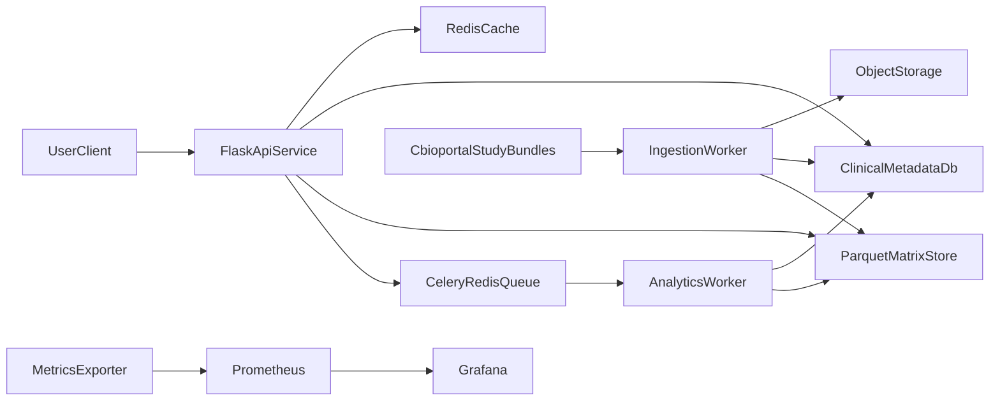

# Core Platform Architecture

## Purpose
This document defines the target architecture for evolving `bcancerportal` into a production-style Flask REST platform inspired by cBioPortal, focused on breast cancer studies while remaining extensible to other cancer types.

## Architecture Goals
- Keep Flask and build a clean modular backend (thin `app.py`)
- Support reliable ingestion of large cBioPortal-like datasets
- Separate storage patterns for transactional vs matrix workloads
- Add operational maturity: CI/CD, observability, runbooks, testing
- Provide interview-ready platform engineering evidence

## Domain Scope
- Current studies: `brca_tcga_pub2015` and `brca_sanger`
- Domain positioning: breast cancer genomics platform
- Extensibility: model supports future non-BRCA studies via `type_of_cancer`

## System Components
- `api-service` (Flask): versioned REST APIs (`/api/v1`)
- `ingestion-worker` (Celery): asynchronous ingestion and heavy analyses
- `redis`: cache + queue broker
- `clinical-db` (Postgres/MySQL): metadata, clinical, mutation, run tracking
- `matrix-store` (Parquet + object storage): mRNA, methylation, CNA, RPPA matrices
- `object-store` (MinIO/S3): raw bundles + processed artifacts
- `observability`: Prometheus, Grafana, structured logs

## Backend Modular Structure
Target Flask backend layout:
- `backend/app.py` (entrypoint only)
- `backend/core/` (app factory, config, logging, error handlers, extensions)
- `backend/api/v1/` (blueprints + schemas)
- `backend/services/` (business logic)
- `backend/repositories/` (db/parquet access)
- `backend/pipeline/` (discover, validate, transform, load, verify)
- `backend/workers/` (Celery tasks)
- `backend/observability/` (metrics/logging/tracing)
- `backend/tests/` (unit/integration/pipeline tests)

## Key Design Decisions
- Keep Flask to preserve momentum and existing code investment
- Avoid logic in route files; routes are adapter layer only
- Split storage to handle wide analytical matrices efficiently
- Make ingestion idempotent and observable
- Treat async jobs as first-class API objects

## Non-Goals (PR-1)
- No code refactor in this PR
- No runtime behavior changes
- No schema migrations yet
